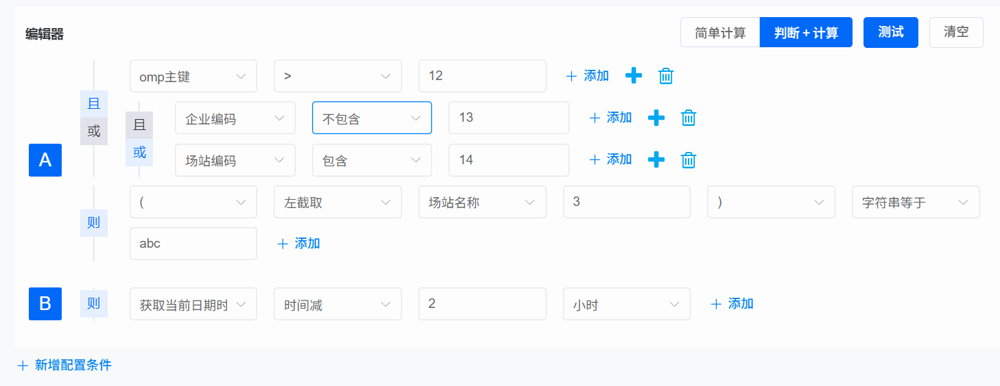

# Rule Engine - 轻量级 Java 规则引擎

[](https://www.oracle.com/java/)
[](LICENSE)
[](CONTRIBUTING.md)

一个基于 Java 的轻量级规则引擎，使用 JSON 格式定义业务规则，支持复杂的逻辑运算、数学计算、字符串处理和日期时间操作。

## ✨ 特性

- 🚀 **声明式规则定义** - 使用 JSON 数组格式，类似 Lisp 的 S-表达式
- 🔄 **递归评估引擎** - 由内向外递归评估嵌套表达式
- 📦 **56+ 内置函数** - 涵盖算术、比较、字符串、日期、逻辑等
- 🔌 **可扩展架构** - 支持自定义函数注册
- ⚡ **性能优化** - 支持短路逻辑运算
- 💯 **类型安全** - 内置类型转换和验证机制

## 📋 目录

- [快速开始](#-快速开始)
- [规则语法](#-规则语法)
- [内置函数](#-内置函数)
- [使用示例](#-使用示例)
- [高级特性](#-高级特性)
- [性能指标](#-性能指标)
- [常见问题](#-常见问题)
- [贡献指南](#-贡献指南)

## 🚀 快速开始

### 环境要求

- Java 8 或更高版本
- Maven 3.x（用于构建）

### 依赖

```xml

<dependencies>
    <!-- FastJSON for JSON parsing -->
    <dependency>
        <groupId>com.alibaba</groupId>
        <artifactId>fastjson</artifactId>
        <version>1.2.83</version>
    </dependency>

    <!-- Lombok for cleaner code -->
    <dependency>
        <groupId>org.projectlombok</groupId>
        <artifactId>lombok</artifactId>
        <version>1.18.24</version>
        <scope>provided</scope>
    </dependency>
</dependencies>
```

### 基础示例

```java
import com.zk.ruleengine.RuleEngine;

import java.util.HashMap;
import java.util.Map;

public class QuickStart {
    public static void main(String[] args) {
        // 1. 获取规则引擎实例（单例）
        RuleEngine engine = RuleEngine.getInstance();

        // 2. 准备上下文数据
        Map<String, Object> context = new HashMap<>();
        context.put("age", 25);
        context.put("income", 8000);
        context.put("city", "北京");

        // 3. 定义规则表达式
        String rule = "[\"if\", " +
                "  [\"&&\", [\">\", [\"@value\", \"age\"], 18], " +
                "          [\">\", [\"@value\", \"income\"], 5000]], " +
                "  [\"strInput\", \"符合条件\"], " +
                "  [\"strInput\", \"不符合条件\"]" +
                "]";

        // 4. 执行规则
        String result = engine.execute(context, rule);
        System.out.println(result);  // 输出: 符合条件
    }
}
```

## 📖 规则语法

### 基本格式

规则表达式采用 JSON 数组格式，第一个元素是函数名，后续元素是参数：

```json
[
  "函数名",
  参数1,
  参数2,
  ...
]
```

### 语法示例

```json
// 简单算术运算
[
  "+",
  1,
  2,
  3
]  // 结果: 6

// 从上下文获取值
[
  "@value",
  "username"
]  // 从 context 中获取 username

// 嵌套表达式
[
  "*",
  [
    "+",
    2,
    3
  ],
  4
]  // (2 + 3) * 4 = 20

// 条件判断
[
  "if",
  [
    ">",
    [
      "@value",
      "age"
    ],
    18
  ],
  // 条件
  [
    "strInput",
    "成年"
  ],
  // true 分支
  [
    "strInput",
    "未成年"
  ]
  // false 分支
]

// 复杂逻辑
[
  "&&",
  [
    "strEq",
    [
      "@value",
      "city"
    ],
    [
      "strInput",
      "北京"
    ]
  ],
  [
    ">",
    [
      "@value",
      "salary"
    ],
    10000
  ]
]
```

## 🔧 内置函数

### 算术运算（9 个）

| 函数 | 说明 | 示例 |
|------|------|------|
| `+` | 加法，支持多参数 | `["+", 1, 2, 3]` → `6` |
| `-` | 减法 | `["-", 10, 3]` → `7` |
| `*` | 乘法 | `["*", 2, 3, 4]` → `24` |
| `/` | 除法 | `["/", 20, 4]` → `5` |
| `%` | 取模 | `["%", 17, 5]` → `2` |
| `abs` | 绝对值 | `["abs", -5]` → `5` |
| `ceil` | 向上取整 | `["ceil", 3.2]` → `4` |
| `floor` | 向下取整 | `["floor", 3.8]` → `3` |
| `scale` | 设置精度 | `["scale", 3.1415, 2]` → `3.14` |

### 数值比较（6 个）

| 函数 | 说明 | 示例 |
|------|------|------|
| `>` | 大于 | `[">", 5, 3]` → `true` |
| `>=` | 大于等于 | `[">=", 5, 5]` → `true` |
| `<` | 小于 | `["<", 3, 5]` → `true` |
| `<=` | 小于等于 | `["<=", 3, 5]` → `true` |
| `==` | 数值相等 | `["==", 5, 5]` → `true` |
| `<>` | 数值不等 | `["<>", 5, 3]` → `true` |

### 字符串操作（8 个）

| 函数 | 说明 | 示例 |
|------|------|------|
| `strEq` | 字符串相等 | `["strEq", "abc", "abc"]` → `true` |
| `strNeq` | 字符串不等 | `["strNeq", "abc", "xyz"]` → `true` |
| `contains` | 包含子串 | `["contains", "hello", "ell"]` → `true` |
| `notContains` | 不包含子串 | `["notContains", "hello", "xyz"]` → `true` |
| `leftSub` | 左截取 | `["leftSub", "hello", 2]` → `"he"` |
| `rightSub` | 右截取 | `["rightSub", "hello", 2]` → `"lo"` |
| `midSub` | 中间截取 (2参数) | `["midSub", "hello", 3]` → `"ell"` |
| `midSub` | 指定位置截取 (3参数) | `["midSub", "hello", 1, 3]` → `"ell"` |

### 逻辑运算（3 个）

| 函数 | 说明 | 示例 |
|------|------|------|
| `&&` | 逻辑与（短路） | `["&&", true, false]` → `false` |
| `\|\|` | 逻辑或（短路） | `["\|\|", true, false]` → `true` |
| `!` | 逻辑非 | `["!", true]` → `false` |

### 日期时间（18 个）

| 函数 | 说明 | 示例 |
|------|------|------|
| `nowDate` | 当前日期 | `["nowDate"]` |
| `nowDateTime` | 当前日期时间 | `["nowDateTime"]` |
| `dateInput` | 日期字面量 | `["dateInput", "2024-01-01"]` |
| `date>` | 日期大于 | `["date>", date1, date2]` |
| `date>=` | 日期大于等于 | `["date>=", date1, date2]` |
| `date<` | 日期小于 | `["date<", date1, date2]` |
| `date<=` | 日期小于等于 | `["date<=", date1, date2]` |
| `date==` | 日期相等 | `["date==", date1, date2]` |
| `date+` | 日期加法 | `["date+", date, 7, "dayUnit"]` |
| `date-` | 日期减法 | `["date-", date, 1, "monthUnit"]` |
| `dayBetween` | 计算天数差 | `["dayBetween", date1, date2]` |
| `hourBetween` | 计算小时差 | `["hourBetween", dt1, dt2]` |
| `minuteBetween` | 计算分钟差 | `["minuteBetween", dt1, dt2]` |
| `secondBetween` | 计算秒数差 | `["secondBetween", dt1, dt2]` |

### 类型转换（4 个）

| 函数 | 说明 | 示例 |
|------|------|------|
| `toStr` | 转字符串 | `["toStr", 123]` → `"123"` |
| `toNumber` | 转数字 | `["toNumber", "456"]` → `456` |
| `toDate` | 转日期 | `["toDate", "2024-01-01"]` |
| `numberInput` | 数字字面量 | `["numberInput", 42]` → `42` (智能类型) |

### 空值判断（7 个）

| 函数 | 说明 | 示例 |
|------|------|------|
| `null` | 是否为 null | `["null", value]` |
| `notNull` | 是否不为 null | `["notNull", value]` |
| `blank` | 是否为空白 | `["blank", ""]` → `true` |
| `notBlank` | 是否不为空白 | `["notBlank", "abc"]` → `true` |
| `numberIsNull` | 数字是否为 null | `["numberIsNull", value]` |
| `numberIsNotNull` | 数字是否不为 null | `["numberIsNotNull", value]` |

### 条件控制（1 个）

| 函数 | 说明 | 示例 |
|------|------|------|
| `if` | 条件分支 (if-elseif-else) | `["if", condition1, result1, condition2, result2, defaultResult]` |

### 上下文操作（1 个）

| 函数 | 说明 | 示例 |
|------|------|------|
| `@value` | 从上下文获取值 | `["@value", "username"]` |

## 💡 使用示例

### 1. 电商折扣计算

```java
Map<String, Object> context=new HashMap<>();
        context.put("userLevel",3);
        context.put("isVIP",true);
        context.put("orderAmount",1000);

// 规则: VIP用户且等级>=3，打8折；否则9折
        String rule="[\"if\", "+
        "  [\"&&\", [\"@value\", \"isVIP\"], "+
        "          [\">=\", [\"@value\", \"userLevel\"], 3]], "+
        "  [\"*\", [\"@value\", \"orderAmount\"], 0.8], "+
        "  [\"*\", [\"@value\", \"orderAmount\"], 0.9]"+
        "]";

        Number finalPrice=engine.execute(context,rule);
// 结果: 800 (1000 * 0.8)
```

### 2. 用户资格验证

```java
context.put("age",28);
        context.put("income",15000);
        context.put("creditScore",750);

// 规则: 年龄18-60，收入>10000，信用分>700
        String rule="[\"&&\", "+
        "  [\"&&\", [\">=\", [\"@value\", \"age\"], 18], "+
        "          [\"<=\", [\"@value\", \"age\"], 60]], "+
        "  [\">\", [\"@value\", \"income\"], 10000], "+
        "  [\">\", [\"@value\", \"creditScore\"], 700]"+
        "]";

        Boolean qualified=engine.execute(context,rule);
// 结果: true
```

### 3. 多级折扣计算

```java
context.put("memberLevel",4);
        context.put("orderAmount",5000);

// 根据会员等级计算折扣
        String rule="[\"if\", "+
        "  [\">=\", [\"@value\", \"memberLevel\"], 5], 0.7, "+
        "  [\">=\", [\"@value\", \"memberLevel\"], 4], 0.8, "+
        "  [\">=\", [\"@value\", \"memberLevel\"], 3], 0.85, "+
        "  [\">=\", [\"@value\", \"memberLevel\"], 2], 0.9, "+
        "  1.0"+
        "]";

        Number discount=engine.execute(context,rule);
        Number finalAmount=5000*discount.doubleValue();
// 结果: 4000 (5000 * 0.8)
```

### 4. 字符串处理

```java
context.put("email","user@example.com");

// 提取邮箱用户名（@之前的部分）
        String rule="[\"midSub\", [\"@value\", \"email\"], 0, 4]";
        String username=engine.execute(context,rule);
// 结果: "user"

// 检查邮箱是否有效
        rule="[\"&&\", "+
        "  [\"contains\", [\"@value\", \"email\"], \"@\"], "+
        "  [\"contains\", [\"@value\", \"email\"], \".\"]"+
        "]";
        Boolean isValid=engine.execute(context,rule);
// 结果: true
```

### 5. 日期计算

```java
context.put("registerDate","2024-01-01");

// 计算注册天数
        String rule="[\"dayBetween\", [\"@value\", \"registerDate\"], [\"nowDate\"]]";
        Long days=engine.execute(context,rule);

// 检查是否在试用期内（30天）
        rule="[\"<=\", "+
        "  [\"dayBetween\", [\"@value\", \"registerDate\"], [\"nowDate\"]], "+
        "  30"+
        "]";
        Boolean inTrialPeriod=engine.execute(context,rule);
```

### 6. 复杂业务规则

```java
// 贷款审批规则
context.put("age",35);
        context.put("income",20000);
        context.put("creditScore",780);
        context.put("existingLoan",100000);
        context.put("requestedAmount",300000);

        String rule="[\"if\", "+
        // 条件1: 基本资格
        "  [\"&&\", "+
        "    [\"&&\", [\">=\", [\"@value\", \"age\"], 22], "+
        "            [\"<=\", [\"@value\", \"age\"], 60]], "+
        "    [\">=\", [\"@value\", \"income\"], 5000], "+
        "    [\">=\", [\"@value\", \"creditScore\"], 650]"+
        "  ], "+
        // 条件2: 负债率检查
        "  [\"if\", "+
        "    [\"<=\", "+
        "      [\"/\", "+
        "        [\"+\", [\"@value\", \"existingLoan\"], [\"@value\", \"requestedAmount\"]], "+
        "        [\"*\", [\"@value\", \"income\"], 12]"+
        "      ], "+
        "      5"+
        "    ], "+
        "    [\"strInput\", \"APPROVED\"], "+
        "    [\"strInput\", \"REJECTED_HIGH_DEBT\"]"+
        "  ], "+
        "  [\"strInput\", \"REJECTED_NOT_QUALIFIED\"]"+
        "]";

        String decision=engine.execute(context,rule);
// 结果: "APPROVED"
```

## 🎓 高级特性

### 自定义函数

```java
import com.zk.ruleengine.Function;
import com.zk.ruleengine.Evaluator;

import java.util.List;

// 1. 实现 Function 接口
public class CustomUpperCase implements Function<String, String> {

    @Override
    public String execute(Evaluator evaluator, List<String> args) {
        if (args.size() != 1) {
            throw new IllegalArgumentException("UpperCase requires exactly one argument");
        }
        String input = args.get(0);
        return input.toUpperCase();
    }

    @Override
    public String name() {
        return "uppercase";
    }
}

    // 2. 注册自定义函数
    RuleEngine engine = RuleEngine.getInstance();
engine.registerFunction(new CustomUpperCase());

// 3. 使用自定义函数
        String rule="[\"uppercase\", [\"strInput\", \"hello\"]]";
        String result=engine.execute(null,rule);
// 结果: "HELLO"
```

### 对象上下文扁平化

规则引擎自动将复杂对象扁平化为 Map：

```java
class User {
    String name;
    int age;
    Address address;
}

class Address {
    String city;
    String street;
}

    User user = new User();
user.name="张三";
        user.age=25;
        user.address=new Address();
        user.address.city="北京";

// 直接传入对象，引擎会自动扁平化
        String rule="[\"@value\", \"address.city\"]";
        String city=engine.execute(user,rule);
// 结果: "北京"
```

### 性能优化 - 短路逻辑

逻辑运算符 `&&` 和 `||` 支持短路评估：

```java
// 当第一个条件为 false 时，不会评估第二个条件
String rule="[\"&&\", "+
        "  [\"<\", [\"@value\", \"age\"], 18], "+
        "  [\">\", [\"复杂计算\"], 100]"+  // 不会执行
        "]";
```

### 配置可视化



**⭐ 如果这个项目对你有帮助，请给一个 Star！**